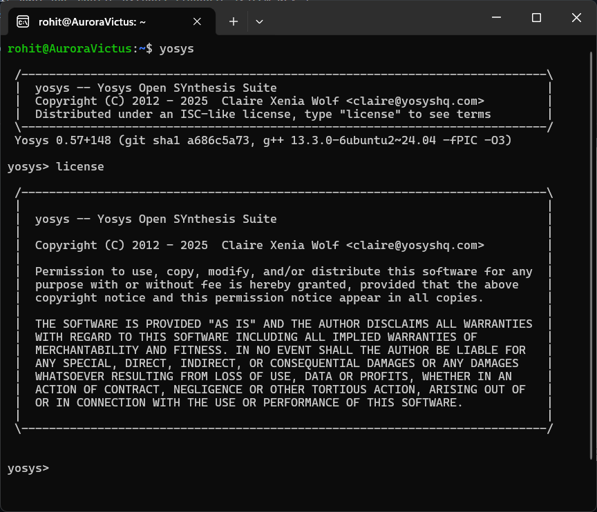
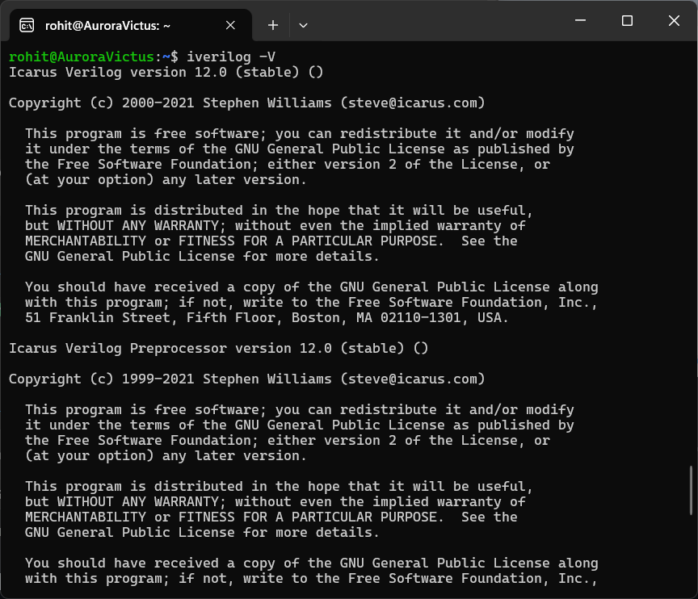
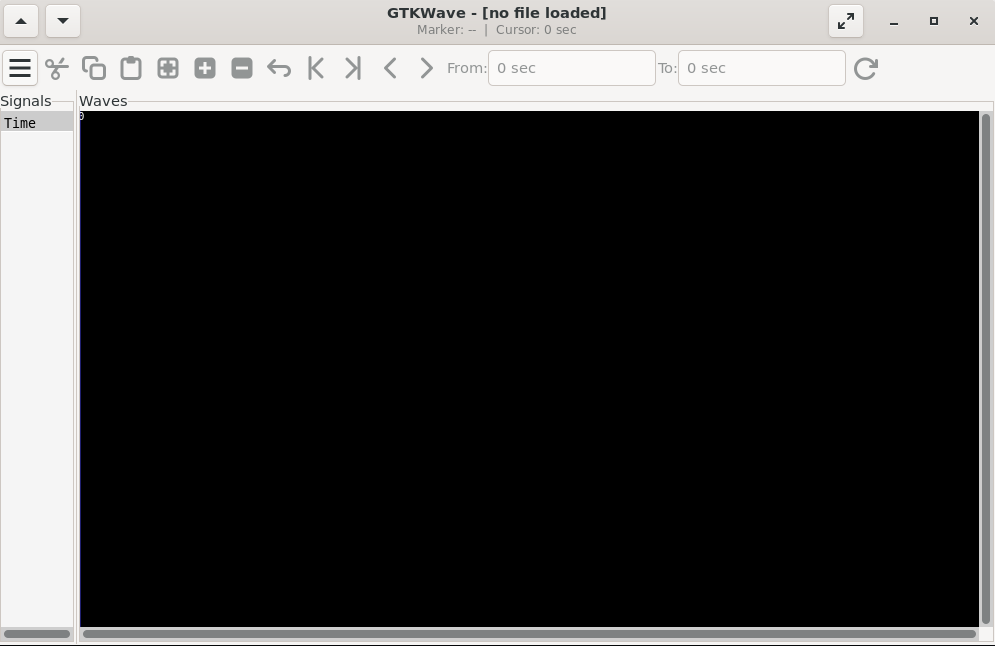
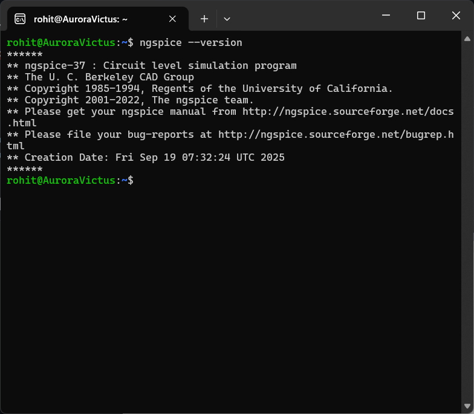
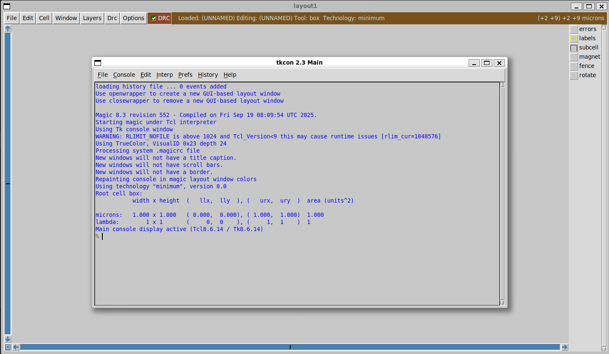

# vsd_RISC-V_Program
> Task - 1
---
> Task - 2
# Day-0 – Tools Installation

This repository documents how I installed core open-source VLSI tools on an Ubuntu VM and proves each install with verification output / screenshots in Windows Subsystem for Linux (WSL) 
---
## Installed tools
- ✅ Yosys — RTL synthesis
- ✅ Icarus Verilog — Verilog simulation
- ✅ GTKWave — Waveform analysis
- ✅ Ngspice — Circuit simulation
- ✅ Magic VLSI — Layout


---

## System configuration used
- OS: Ubuntu 20.04+ (VirtualBox VM)
- RAM: 6 GB
- Disk: 50 GB
- CPU: 4 vCPU

---

## 1) Yosys — RTL synthesis
**What it is:** Yosys is an open source RTL synthesis tool (converts Verilog into logic/netlists; used in flows & OpenLane).

### Installation
```bash
# 1. Update package lists
sudo apt-get update

# 2. Clone Yosys source code
git clone https://github.com/YosysHQ/yosys.git

# 3. Enter the yosys directory
cd yosys

# 4. Install 'make' if not already installed
sudo apt install make

# 5. Install all required dependencies
sudo apt-get install build-essential clang bison flex \
libreadline-dev gawk tcl-dev libffi-dev git \
graphviz xdot pkg-config python3 libboost-system-dev \
libboost-python-dev libboost-filesystem-dev zlib1g-dev

# 6. Configure Yosys for gcc build
make config-gcc

# 7. Compile Yosys (this may take a while)
make

# 8. Install Yosys system-wide
sudo make install

```

### Verification
```bash
yosys -V
```

### Screenshot (upload to `screenshots/yosys.png`)


---

## 2) Icarus Verilog (iverilog) — Verilog simulator
**What it is:** Icarus Verilog compiles and simulates Verilog code (fast for RTL simulation).

### Installation
```bash
# Update package lists
sudo apt-get update

# Install Icarus Verilog
sudo apt-get install iverilog
```

### Verification
```bash
iverilog -V
```

### Screenshot (upload to `screenshots/iverilog.png`)


---

## 3) GTKWave — Waveform viewer
**What it is:** GTKWave visualizes VCD/EVCD waveforms produced by simulators like iverilog.

### Installation
```bash
# Update package lists
sudo apt-get update

# Install GTKWave
sudo apt-get install gtkwave
```

### Verification
```bash
gtkwave --version
```

### Screenshot (upload to `screenshots/gtkwave.png`)


---

## 4) ngspice — Circuit simulator
**What it is:** SPICE-compatible simulator for analog & mixed-signal circuits.

### Installation (binary via apt — easiest)
```bash
# Update package lists
sudo apt-get update

# Install Ngspice
sudo apt-get install ngspice
```

> If building from tarball is needed, follow tarball steps; if configure fails with Xaw error, install Xaw dev packages:
```bash
sudo apt-get install libxaw7-dev xaw3dg xaw3dg-dev
```

### Verification
```bash
ngspice -v
```

### Screenshot (upload to `screenshots/ngspice.png`)


---

## 5) Magic VLSI — Layout editor
**What it is:** Magic is an open-source layout tool used for GDS and LVS workflows.

### Installation (binary via apt if available)
```bash
# Update package lists
sudo apt-get update

# Install dependencies for Magic
sudo apt-get install m4 tcsh csh libx11-dev tcl-dev tk-dev \
libx11-xcb-dev libglu1-mesa-dev freeglut3-dev mesa-common-dev \
libncurses-dev

# Clone Magic source code
git clone https://github.com/RTimothyEdwards/magic.git

# Enter magic directory
cd magic

# Configure Magic
./configure

# Compile Magic
make

# Install Magic
sudo make install

```

### Or build from source (if needed)
```bash
sudo apt-get install m4 tcsh csh libx11-dev tcl-dev tk-dev \
 libcairo2-dev mesa-common-dev libglu1-mesa-dev libncurses-dev
git clone https://github.com/RTimothyEdwards/magic
cd magic
./configure
make
sudo make install
```

### Verification
```bash
magic -version
```


### Screenshot (upload to `screenshots/magic.png`)


---
