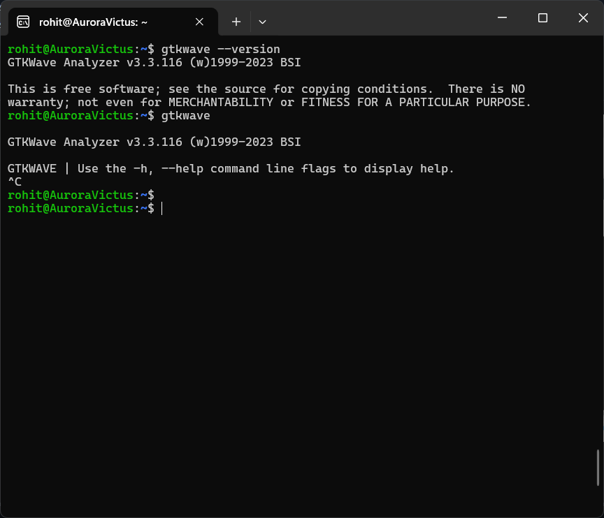

<h1 align="center"><b>RISC‑V Reference SoC Tapeout Program</b></h1>
<h3 align="center"><b><i><a href="https://in.linkedin.com/in/kunal-ghosh-vlsisystemdesign-com-28084836" target="_blank">-by, Kunal Ghosh</a></i></b></h3>

> Task - 1
# 📘 Summary of Video: Chip Design Flow

This section summarizes the introductory video on chip design and SoC flow.  
It explains how an application written in C eventually runs on real silicon.

---

## 🔹 Key Steps in the Flow

1. **Application & Compiler**
   - Application (C code) compiled with GCC → output `O0`.
   - Processor specs modeled in C (e.g., RISC-V GCC) → output `O1`.
   - ✅ Check if `O0 = O1` → freeze specifications.

2. **Soft Hardware (RTL)**
   - Write hardware in Verilog/Chisel/Bluespec.
   - Run app again → output `O2`.
   - ✅ Ensure `O1 = O2`.

3. **SoC Partitioning**
   - Processor → synthesizable Verilog.
   - Peripherals:
     - Macros (synthesizable).
     - Analog IPs (ADC, PLL → not synthesizable).
   - Integration produces SoC → output `O3`.
   - ✅ Ensure `O1 = O2 = O3`.

4. **Processor vs Microcontroller**
   - Processor = CPU core only (needs external peripherals).
   - Microcontroller = processor + peripherals + IPs (single chip).

5. **Physical Design**
   - RTL → Gates → Layout → **GDSII file**.
   - Run **DRC/LVS checks** → tape-out to foundry.
   - Fabricated chip comes back as **tape-in**.

6. **Chip Bring-up**
   - Chip packaged & mounted on a board with memory, regulators, etc.
   - Application runs → output `O4`.
   - ✅ Final check: `O1 = O2 = O3 = O4`.

---

## 🔹 Timeline
- Complete chip cycle: **14–16 months**.  
- Foundry alone: **4–6 months**.

---

## 🔹 Applications
- Designed RISC-V chip runs at **100–130 MHz**.  
- Suitable for:
  - Arduino-like boards  
  - TV panels (low-freq side)  
  - AC controllers  
  - Embedded/IoT devices  

---

## 🔹 Workshop Scope
- Focus is on a small block (glue block).  
- Example: design & integrate a simple inverter IP.  
- Learn end-to-end flow: **C code → Chip → Board**.

---
> Task - 2
# Day-0 – Tools Installation

This repository documents how I installed core open-source VLSI tools on an Ubuntu VM and proves each install with verified screenshots in Windows Subsystem for Linux (WSL) 
---
## Installed tools
- ✅ Yosys — RTL synthesis
- ✅ Icarus Verilog — Verilog simulation
- ✅ GTKWave — Waveform analysis
- ✅ Ngspice — Circuit simulation
- ✅ Magic VLSI — Layout


## System configuration used
- OS: Windows 10/11 with **Windows Subsystem for Linux (WSL 2)** running Ubuntu 20.04+  
- CPU: 12 logical processors assigned to WSL  
- RAM: 3759 MB allocated to WSL  
- Swap: 1024 MB  
- Disk: 50 GB allocated to WSL  
**ALL by default not set**
---

> Note: 
I installed these tools on **WSL Ubuntu** instead of a full VM.
---

## 1) Yosys — RTL synthesis
**What it is:** Yosys is an open source RTL synthesis tool (converts Verilog into logic/netlists; used in flows & OpenLane).

### Installation
```bash
# 1. Update package lists
sudo apt-get update

# 2. Clone Yosys source code
git clone https://github.com/YosysHQ/yosys.git

# 3. Enter the yosys directory
cd yosys

# 4. Install 'make' if not already installed
sudo apt install make

# 5. Install all required dependencies
sudo apt-get install build-essential clang bison flex \
libreadline-dev gawk tcl-dev libffi-dev git \
graphviz xdot pkg-config python3 libboost-system-dev \
libboost-python-dev libboost-filesystem-dev zlib1g-dev

# 6. Configure Yosys for gcc build
make config-gcc

# 7. Compile Yosys (this may take a while)
make

# 8. Install Yosys system-wide
sudo make install

```
### Submodule Initialization (if required)

**Issue:** During `make`, you may see an error like:

`
Initialize the submodule: Run 'git submodule update --init' to set up 'abc' as a submodule.
`
`
make: *** [Makefile:811: check-git-abc] Error 1
`

**Solution:** Initialize the git submodules before building:

```bash
# Initialize and update submodules (run inside the project folder)
git submodule update --init
```

### Verification
```bash
yosys
```
```bash
#for license
license
```


### Screenshot
<p align="center">
  
</p>

> to close or exit yosys press: ctrl+c


## 2) Icarus Verilog (iverilog) — Verilog simulator
**What it is:** Icarus Verilog compiles and simulates Verilog code (fast for RTL simulation).

### Installation
```bash
# Update package lists
sudo apt-get update

# Install Icarus Verilog
sudo apt-get install iverilog
```

### Verification
```bash
iverilog -V
```

### Screenshot
<p align="center">
  
</p>

## 3) GTKWave — Waveform viewer
**What it is:** GTKWave visualizes VCD/EVCD waveforms produced by simulators like iverilog.

### Installation
```bash
# Update package lists
sudo apt-get update

# Install GTKWave
sudo apt-get install gtkwave
```

### Verification
```bash
gtkwave --version
```

### Screenshot
<table>
  <tr>
    <td>
      
    </td>
    <td>
      
    </td>
  </tr>
</table>

> to close or exit GTKwave press: ctrl+c

## 4) ngspice — Circuit simulator
**What it is:** SPICE-compatible simulator for analog & mixed-signal circuits.

### Installation (binary via apt — easiest)
```bash
# Update package lists
sudo apt-get update

# Install Ngspice
sudo apt-get install ngspice
```

> If building from tarball is needed, follow tarball steps; if configure fails with Xaw error, install Xaw dev packages:
```bash
# 1. Update package lists
sudo apt-get update

# 2. Download Ngspice tarball (from SourceForge)
wget https://sourceforge.net/projects/ngspice/files/ngspice-37.tar.gz

# 3. Extract the tarball
tar -zxvf ngspice-37.tar.gz
cd ngspice-37

# 4. Create a build directory
mkdir release
cd release

# 5. Configure the build with X11 and readline support, and disable debug
../configure --with-x --with-readline=yes --disable-debug

# 6. If Xaw-related errors occur, install extra Xaw libraries
sudo apt-get install libxaw7-dev xaw3dg xaw3dg-dev

# 7. Compile Ngspice
make

# 8. Install Ngspice system-wide
sudo make install

# 9. Re-run configure, make, and install if needed
../configure --with-x --with-readline=yes --disable-debug
make
sudo make install
```

### Verification
```bash
ngspice --version
```

### Screenshot
<p align="center">
  
</p>

## 5) Magic VLSI — Layout editor
**What it is:** Magic is an open-source layout tool used for GDS and LVS workflows.

### Installation (binary via apt if available)
```bash
# Update package lists
sudo apt-get update

# Install dependencies for Magic
sudo apt-get install m4 tcsh csh libx11-dev tcl-dev tk-dev \
libx11-xcb-dev libglu1-mesa-dev freeglut3-dev mesa-common-dev \
libncurses-dev

# Clone Magic source code
git clone https://github.com/RTimothyEdwards/magic.git

# Enter magic directory
cd magic

# Configure Magic
./configure

# Compile Magic
make

# Install Magic
sudo make install

```

### Or build from source (if needed)
```bash
sudo apt-get install m4 tcsh csh libx11-dev tcl-dev tk-dev \
 libcairo2-dev mesa-common-dev libglu1-mesa-dev libncurses-dev
git clone https://github.com/RTimothyEdwards/magic
cd magic
./configure
make
sudo make install
```

### Verification
```bash
magic --version
```

### Screenshot
<p align="center">
  
</p>
