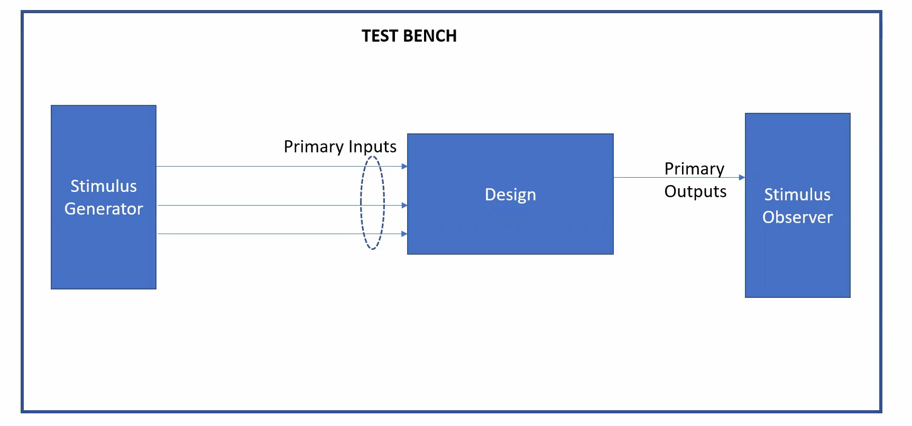
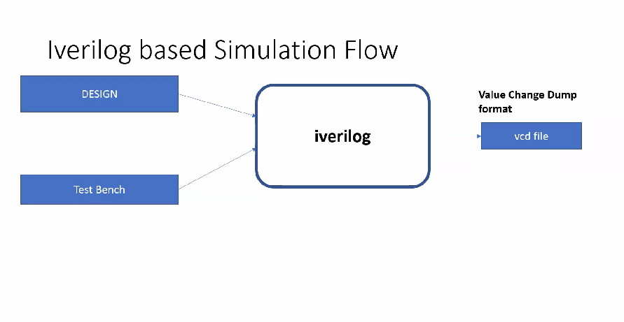
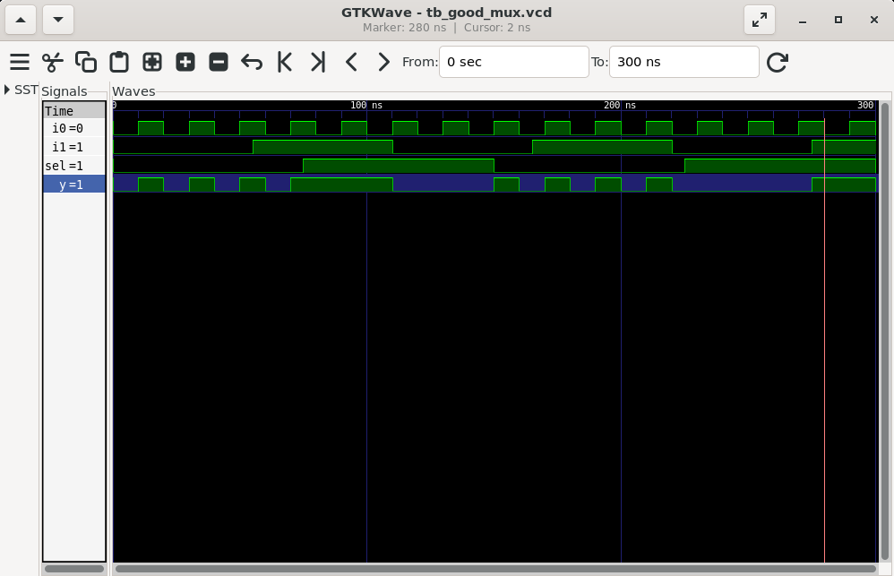
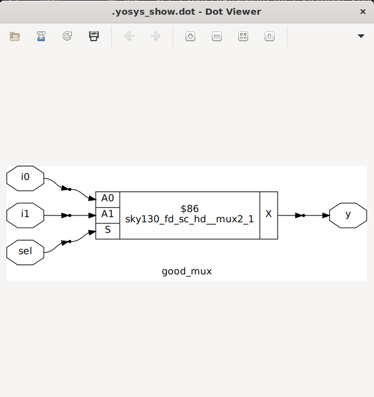

# Day 1 - Introduction to Verilog RTL Design and Synthesis Using Sky130 Library

This repository captures the hands-on flow of setting up, compiling, and simulating a Verilog design using **Icarus Verilog (iverilog)** and visualizing the results with **GTKWave**.  
The example used is a **2-to-1 Multiplexer (MUX)**.

The aim of this session is to understand:

- What a simulator does in RTL design.
- The role of a design file and a testbench.
- How to run simulations using iverilog and debug waveforms in GTKWave.

---

## 📑 Table of Contents

1. [What is a Simulator, Design, and Testbench?](#what-is-a-simulator-design-and-testbench)
2. [Getting Started with iverilog](#getting-started-with-iverilog)
3. [Lab: Simulating a 2-to-1 Multiplexer](#lab-simulating-a-2-to-1-multiplexer)
4. [Verilog Code Analysis](#verilog-code-analysis)
5. [Introduction to Yosys & Gate Libraries](#introduction-to-yosys--gate-libraries)
6. [Synthesis Lab with Yosys](#synthesis-lab-with-yosys)
7. [Summary](#summary)

---

## What is a Simulator, Design, and Testbench?

**Design File (RTL):**  
Contains the actual logic implementation of the hardware (e.g., `good_mux.v` for a 2-to-1 multiplexer).

**Testbench File:**  
Provides inputs and expected behavior to verify the design (e.g., `tb_good_mux.v`).  
Testbenches **do not synthesize** into hardware.  
They simulate stimulus and check the response of the design.

**Simulator:**  
A tool (like Icarus Verilog) that takes both design + testbench files, compiles them, and produces a simulation output.  
Generates a **VCD (Value Change Dump)** file that stores waveform data.  

The VCD can be viewed using **GTKWave** to confirm correct design behavior.
<p align="center">
  
</p>

---

## Getting Started with iverilog
Icarus Verilog (`iverilog`) is a free and open-source Verilog simulation and synthesis tool. It allows you to compile Verilog design files along with testbenches to generate simulation output.

<p align="center">
  
</p>


**Step 1 – Set up the workshop repository:**

*Create a working folder*
```bash
mkdir vsd
cd vsd
````
*Clone the Sky130 workshop repo*
```bash
git clone https://github.com/kunalg123/sky130RTLDesignAndSynthesisWorkshop.git
````
*Enter the repo*
```bash
cd sky130RTLDesignAndSynthesisWorkshop
````

**Explore the repo structure:**

* `my_lib/` → Custom libraries.
* `lib/` → Standard cell libraries.
* `verilog_files/` → Verilog source codes and testbenches.

> We will focus on the Verilog MUX example inside `verilog_files/`.

---

## Lab: Simulating a 2-to-1 Multiplexer

**Step 1 – Move to Verilog files folder:**

```bash
cd verilog_files
```

**Step 2 – Compile design and testbench with iverilog:**

```bash
iverilog good_mux.v tb_good_mux.v
```

> This generates an executable file `a.out`.

**Step 3 – Run the simulation:**

```bash
./a.out
```

> This creates a waveform file `tb_good_mux.vcd`.

**Step 4 – Open waveform in GTKWave:**

```bash
gtkwave tb_good_mux.vcd
```

> This opens the signals in a graphical waveform viewer for analysis.

---
<p align="center">
  
</p>


## Verilog Code Analysis

**`good_mux.v`** → Implements a 2:1 multiplexer.

* Inputs: `a`, `b`, `sel`
* Output: `y`
* Code:
```verilog
module good_mux (input i0, input i1, input sel, output reg y);
always @ (*)
begin
    if(sel)
        y <= i1;
    else 
        y <= i0;
end
endmodule
```

**`tb_good_mux.v`** → Provides stimulus.

* Applies different combinations of `a`, `b`, and `sel`.
* Observes whether `y` follows the expected behavior.

> The waveforms in GTKWave confirm whether the design is functionally correct.

---

## Introduction to Yosys & Gate Libraries

* **Yosys** is an open-source tool for RTL synthesis.
* After simulation, the next step is **synthesis** → converting RTL Verilog into a gate-level netlist using standard cell libraries (like Sky130).
* The `lib/` folder in the repo provides these libraries.

---

## Synthesis Lab with Yosys

> Note: All file edits in this repository were done using **gedit** instead of **gvim**.

### Introduction to Yosys & Gate Libraries

**Yosys** is an open-source tool for RTL synthesis.  
After simulation, the next step is **synthesis** → converting RTL Verilog into a gate-level netlist using standard cell libraries (like Sky130).  
The `lib/` folder in the repo provides these libraries.

### Basic Yosys Synthesis Flow for `good_mux.v`

```yosys
# Load standard cell library
read_liberty -lib ../lib/sky130_fd_sc_hd__tt_025C_1v80.lib

# Read the RTL design
read_verilog good_mux.v

# Synthesize the top module
synth -top good_mux

# Map to standard cells
abc -liberty ../lib/sky130_fd_sc_hd__tt_025C_1v80.lib

# Show the synthesized netlist graphically
show

# Export synthesized netlist to Verilog
write_verilog good_mux_netlist.v

# Optional: Open in text editor for inspection
# Note: Using gedit here instead of gvim
!gedit good_mux_netlist.v

````

### Handling RTLIL Process Warning

If you get a warning like:

```
Module good_mux contains RTLIL processes with sync rules...
Use "proc" to convert processes to logic networks and registers.
```

You can fix it by running:

```yosys
proc
write_verilog -noattr good_mux_netlist.v
!gedit good_mux_netlist.v
```

* `proc` converts internal RTLIL processes into logic networks (gates and registers) suitable for Verilog output.
* Using `-noattr` removes Yosys-specific attributes for a cleaner netlist.

> After this step, the generated Verilog netlist should be ready for gate-level simulation or further flow without warnings.

### Notes

* You can view your netlist at any point with the `show` command.
* The `.lib` file provides timing and cell information for Sky130 standard cells, which `abc` uses for mapping.
* This workflow ensures your RTL is safely converted into a synthesizable, gate-level netlist.

<p align="center">
  
</p>

---

## Summary

* Learned about the roles of **design, testbench, and simulator** in RTL design.
* Set up the Sky130 workshop repo.
* Simulated a **2-to-1 multiplexer** using Icarus Verilog.
* Verified functionality by analyzing waveforms in GTKWave.
* Prepared for the next step: **RTL synthesis with Yosys**.
