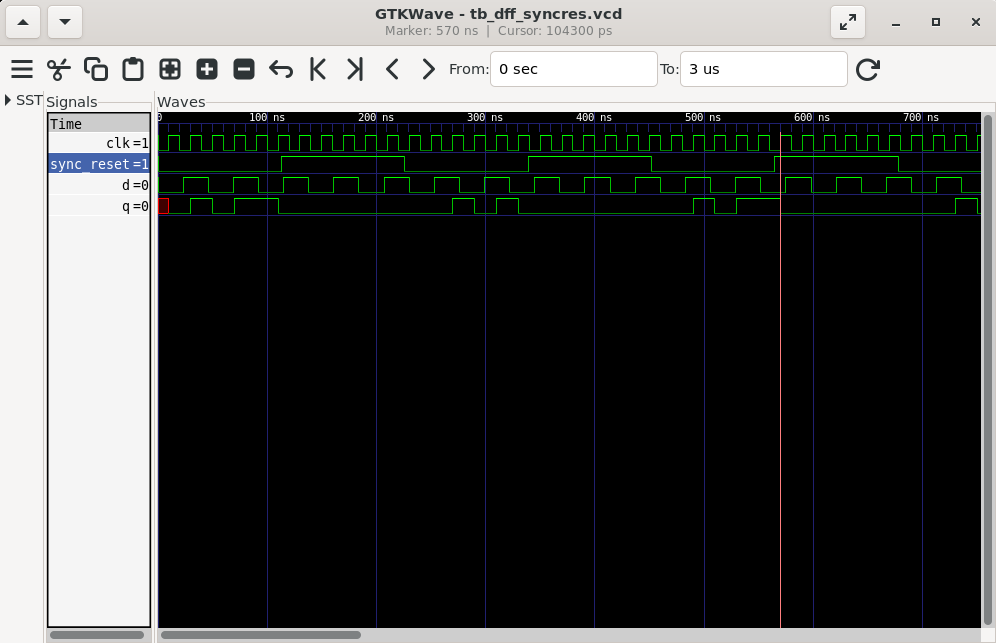

# Day 2 – Timing Libraries, Hierarchical vs Flat Synthesis, and Flip-Flop Coding Styles

## Table of Contents
- [SKY130 PDK Overview](#sky130-pdk-overview)
- [Decoding tt_025C_1v80 in the SKY130 PDK](#decoding-tt_025c_1v80-in-the-sky130-pdk)
- [Opening and Exploring the .lib File](#opening-and-exploring-the-lib-file)
- [Verilog Design for Synthesis](#verilog-design-for-synthesis)
- [Hierarchical Synthesis](#hierarchical-synthesis)
- [Flattened Synthesis](#flattened-synthesis)
- [Submodule-Level Synthesis](#submodule-level-synthesis)
- [Key Differences: Hierarchical vs Flattened](#key-differences-hierarchical-vs-flattened)
- [Flip-Flops (DFFs)](#flip-flops-dffs)
  - [Asynchronous Reset](#a-asynchronous-reset)
  - [Asynchronous Set](#b-asynchronous-set)
  - [Synchronous Reset](#c-synchronous-reset)
- [Simulation Steps](#simulation-steps)
- [Synthesis of Flip-Flops](#synthesis-of-flip-flops)
- [Optimization Examples](#optimization-examples)
- [Combinational Logic Optimization](#combinational-logic-optimization)

---

## SKY130 PDK Overview
The **SKY130 Process Design Kit (PDK)** is an open-source library provided for 130nm CMOS technology.  

It includes:
- **Standard cell libraries** (NAND, NOR, Flip-Flops, etc.)
- **Timing information** for different process, voltage, and temperature (PVT) conditions
- **Power and area characterization**

This information is stored inside `.lib` (Liberty) files.

---

## Decoding `tt_025C_1v80` in the SKY130 PDK
Example file: `sky130_fd_sc_hd__tt_025C_1v80.lib`

- **tt** → Typical process corner (others: ss – slow, ff – fast)  
- **025C** → Temperature = 25°C  
- **1v80** → Operating Voltage = 1.8V  

### PVT (Process, Voltage, Temperature)
- **P (Process):** Variations due to fabrication  
- **V (Voltage):** Supply voltage changes  
- **T (Temperature):** Ambient operating temperature  

Together, they determine circuit performance.  

---

## Opening and Exploring the `.lib` File
```bash
gedit sky130_fd_sc_hd__tt_025C_1v80.lib
````

Inside `.lib`, each **cell** has:

* **Leakage power** (for each input combination)
* **Area** and **timing information**
* **Pins with functionality**

Example:

```liberty
cell (sky130_fd_sc_hd__a2111o_1) {
    // 2-input AND + OR function
    // _0, _1, _2 → transistor sizing variants
}
```

---

## Verilog Design for Synthesis

Example multi-module design:

```verilog
module sub_module2 (input a, input b, output y);
    assign y = a | b;
endmodule

module sub_module1 (input a, input b, output y);
    assign y = a & b;
endmodule

module multiple_modules (input a, input b, input c, output y);
    wire net1;
    sub_module1 u1(.a(a),.b(b),.y(net1));  // net1 = a & b
    sub_module2 u2(.a(net1),.b(c),.y(y));  // y = (a & b) | c
endmodule
```

---

## Hierarchical Synthesis

```tcl
read_liberty -lib ../lib/sky130_fd_sc_hd__tt_025C_1v80.lib
read_verilog multiple_modules.v
synth -top multiple_modules
abc -liberty ../lib/sky130_fd_sc_hd__tt_025C_1v80.lib
show
write_verilog -noattr multiple_modules_hier.v
!gedit multiple_modules_hier.v
```

Screenshot:
<p align="center">
  
</p>

---

## Flattened Synthesis

```tcl
read_verilog multiple_modules_hier.v
flatten
write_verilog -noattr multiple_modules_flat.v
!gedit multiple_modules_flat.v
show
```

Screenshot:
<p align="center">
  
</p>
---

## Submodule-Level Synthesis

To synthesize only one submodule:

```tcl
read_verilog multiple_modules.v
synth -top sub_module1
abc -liberty ../lib/sky130_fd_sc_hd__tt_025C_1v80.lib
show
```
Screenshot:
<p align="center">
  
</p>
<p align="center">
  
</p>
---

## Key Differences: Hierarchical vs Flattened

* **Hierarchical:** Keeps module boundaries, easier debugging
* **Flattened:** Breaks down into primitive gates, harder to debug but needed for optimization

---

## Flip-Flops (DFFs)

Combinational circuits may cause **glitches** due to propagation delay. To avoid glitches, outputs are registered using **flip-flops**.

### Initialization

* **Reset/Set** signals are used to initialize FFs.
* Can be **Asynchronous** (independent of clock) or **Synchronous** (dependent on clock).

---

### (a) Asynchronous Reset

```verilog
module dff_asyncres (input clk, input async_reset, input d, output reg q);
  always @ (posedge clk, posedge async_reset)
    if (async_reset)
      q <= 1'b0;
    else
      q <= d;
endmodule
```

### (b) Asynchronous Set

```verilog
module dff_async_set (input clk, input async_set, input d, output reg q);
  always @ (posedge clk, posedge async_set)
    if (async_set)
      q <= 1'b1;
    else
      q <= d;
endmodule
```

### (c) Synchronous Reset

```verilog
module dff_syncres (input clk, input async_reset, input sync_reset, input d, output reg q);
  always @ (posedge clk)
    if (sync_reset)
      q <= 1'b0;
    else
      q <= d;
endmodule
```

---

## Simulation Steps

```bash
iverilog dff_asyncres.v tb_dff_asyncres.v
./a.out
gtkwave tb_dff_asyncres.v
```
Screenshot:
<p align="center">
  
</p>

```bash
iverilog dff_async_set.v tb_dff_async_set.v
./a.out
gtkwave tb_dff_async_set.v
```

Screenshot:
<p align="center">
  
</p>

```bash
iverilog dff_syncres.v tb_dff_syncres.v
./a.out
gtkwave tb_dff_syncres.v
```

Screenshot:
<p align="center">
  
</p>


## Synthesis of Flip-Flops

```tcl
read_liberty -lib ../lib/sky130_fd_sc_hd__tt_025C_1v80.lib
```
```tcl
read_verilog dff_asyncres.v
synth -top dff_asyncres
dfflibmap -liberty ../lib/sky130_fd_sc_hd__tt_025C_1v80.lib
abc -liberty ../lib/sky130_fd_sc_hd__tt_025C_1v80.lib
show
```
Screenshot:
<p align="center">
  
</p>

```tcl
read_verilog dff_async_set.v
synth -top dff_async_set
dfflibmap -liberty ../lib/sky130_fd_sc_hd__tt_025C_1v80.lib
abc -liberty ../lib/sky130_fd_sc_hd__tt_025C_1v80.lib
show
```
Screenshot:
<p align="center">
  
</p>

```tcl
read_verilog dff_syncres.v
synth -top dff_syncres
dfflibmap -liberty ../lib/sky130_fd_sc_hd__tt_025C_1v80.lib
abc -liberty ../lib/sky130_fd_sc_hd__tt_025C_1v80.lib
show
```

Screenshot:
<p align="center">
  
</p>

---

## Optimization Examples

### Example 1: Multiply by 2

```verilog
module mul2 (input [2:0] a, output [3:0] y);
    assign y = a * 2;
endmodule
```

Yosys optimization result:

```verilog
assign y = {a, 1'h0}; // just left shift
```
Screenshot:
<p align="center">
  
</p>

---

### Example 2: Multiply by 9

```verilog
module mult8 (input [2:0] a , output [5:0] y);
    assign y = a * 9;
endmodule
```

Optimized netlist:

```verilog
assign y = {a, a}; // concatenation (a*8 + a)
```
Screenshot:
<p align="center">
  
</p>

---

## Combinational Logic Optimization

1. **Squeezing logic** for efficiency
2. **Constant Propagation**
3. **Boolean Logic Optimization** (K-map, Quine-McCluskey, etc.)

Example:

```verilog
y = ((A & B) | C)’ , if A = 0 → y = C’
```

Another:

```verilog
y = A ? (B ? C : (C ? A : 0)) : !C
// Simplified → y = A XNOR B
```

---
