# Day 3 - Combinational and Sequential Optimizations

## Table of Contents
1. [Introduction](#introduction)  
2. [Logic Optimization](#logic-optimization)  
   - [Combinational Logic Optimization](#combinational-logic-optimization)  
   - [Sequential Logic Optimization](#sequential-logic-optimization)  
   - [Advanced Optimizations (Not Covered in Lab)](#advanced-optimizations-not-covered-in-lab)  
3. [Lab Exercises](#lab-exercises)  
   - [Combinational Optimization](#combinational-optimization)  
   - [Multiple Module Optimization](#multiple-module-optimization)  
   - [Sequential Optimization](#sequential-optimization)  
   - [Unused Output Optimization](#unused-output-optimization)  
4. [Screenshots](#screenshots)  

---

## Introduction
The goal of this session is to understand how synthesis tools perform **logic optimization** to minimize design area, reduce power, and improve performance. Both **combinational** and **sequential** optimizations are explored, with Yosys as the synthesis tool.

---

## Logic Optimization

### Combinational Logic Optimization
- **Squeezing the logic**: Reducing unnecessary gates or logic expressions to form a smaller, equivalent circuit.  
- **Constant Propagation**: If an input is tied to a constant (`0` or `1`), the logic can be simplified directly.  
- **Boolean Logic Optimization**: Using algebraic methods (K-map, Quine–McCluskey) to minimize logic.  

**Example:**  
`y = ((A & B) + C)’`  
- If `A = 0`, the expression simplifies to `y = C’`.  

Another case:  
```verilog
Y = a ? (b ? c : (c ? a : 0)) : !c;
````

After simplification:
`Y = A XNOR B`

Thus, synthesis tools automatically perform these simplifications.

---

### Sequential Logic Optimization

* **Constant Propagation in Sequential Circuits**:
  If a flip-flop’s input is tied to a constant, the output is predictable regardless of reset.
  Example:

  * If `D` is tied to `0`, then `Q` is always `0`.
  * If `Q` is later ANDed with another signal `A`, the output becomes fixed and may optimize to a constant.

These optimizations help reduce redundant registers and gates.

---

### Advanced Optimizations (Not Covered in Lab)

* **State Optimization**: Removal of unused states in FSMs.
* **Retiming**: Redistribution of flip-flops to balance delays across paths (e.g., moving FFs to equalize 200 MHz vs. 500 MHz paths).
* **Sequential Logic Cloning (Floorplan Aware Synthesis)**: Duplicate registers if they drive distant loads to improve timing closure.

---

## Lab Exercises

### Combinational Optimization

#### opt\_check.v

```verilog
module opt_check (input a , input b , output y);
  assign y = a ? b : 0;
endmodule
```

#### opt\_check2.v

```verilog
module opt_check2 (input a , input b , output y);
  assign y = a ? 1 : b;
endmodule
```

#### opt\_check3.v

```verilog
module opt_check3 (input a , input b, input c , output y);
  assign y = a ? (c ? b : 0) : 0;
endmodule
```

#### opt\_check4.v

```verilog
module opt_check4 (input a , input b , input c , output y);
  assign y = a ? (b ? (a & c) : c) : (!c);
endmodule
```

**Yosys Commands**

```tcl
read_liberty -lib ../lib/sky130_fd_sc_hd__tt_025C_1v80.lib
read_verilog opt_check.v
opt_clean -purge
abc -liberty ../lib/sky130_fd_sc_hd__tt_025C_1v80.lib
show
```

Screenshot:

<table align="center">
  <tr>
    <td align="center">
      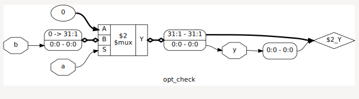<br/>
      opt_check
    </td>
    <td align="center">
      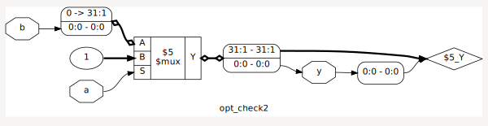<br/>
      opt_check2
    </td>
  </tr>
  <tr>
    <td align="center">
      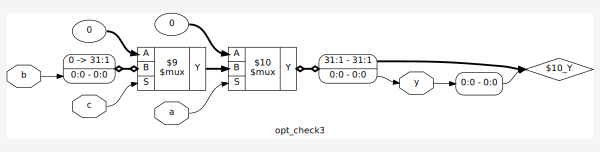<br/>
      opt_check3
    </td>
    <td align="center">
      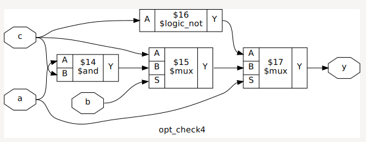<br/>
      opt_check4
    </td>
  </tr>
</table>


### Multiple Module Optimization

#### multiple\_module\_opt.v

```verilog
module sub_module1(input a , input b , output y);
  assign y = a & b;
endmodule

module sub_module2(input a , input b , output y);
  assign y = a ^ b;
endmodule

module multiple_module_opt(input a , input b , input c , input d , output y);
  wire n1,n2,n3;
  sub_module1 U1 (.a(a) , .b(1'b1) , .y(n1));
  sub_module2 U2 (.a(n1), .b(1'b0) , .y(n2));
  sub_module2 U3 (.a(b), .b(d) , .y(n3));
  assign y = c | (b & n1); 
endmodule
```

#### multiple\_module\_opt2.v

```verilog
module sub_module(input a , input b , output y);
  assign y = a & b;
endmodule

module multiple_module_opt2(input a , input b , input c , input d , output y);
  wire n1,n2,n3;
  sub_module U1 (.a(a) , .b(1'b0) , .y(n1));
  sub_module U2 (.a(b), .b(c) , .y(n2));
  sub_module U3 (.a(n2), .b(d) , .y(n3));
  sub_module U4 (.a(n3), .b(n1) , .y(y));
endmodule
```

**Yosys Commands**

```tcl
read_liberty -lib ../lib/sky130_fd_sc_hd__tt_025C_1v80.lib
read_verilog multiple_module_opt.v
flatten
opt_clean -purge
abc -liberty ../lib/sky130_fd_sc_hd__tt_025C_1v80.lib
show
```

Screenshot:
<table align="center">
  <tr>
    <td align="center">
      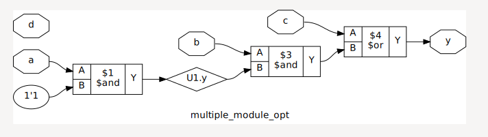<br/>
      multiple_module_opt
    </td>
    <td align="center">
      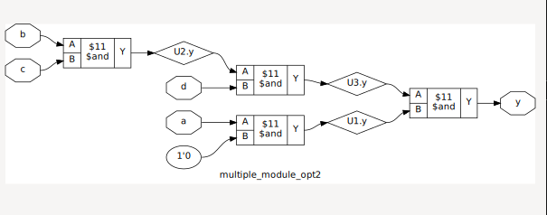<br/>
      multiple_module_opt2
    </td>
  </tr>
</table>

### Sequential Optimization

#### dff\_const1.v

```verilog
module dff_const1(input clk, input reset, output reg q);
always @(posedge clk, posedge reset) begin
  if(reset)
    q <= 1'b0;
  else
    q <= 1'b1;
end
endmodule
```
#### dff\_const2.v
```verilog
module dff_const2(input clk, input reset, output reg q);
always @(posedge clk, posedge reset)
begin
	if(reset)
		q <= 1'b1;
	else
		q <= 1'b1;
end
endmodule
```
#### dff\_const3.v
```verilog
module dff_const3(input clk, input reset, output reg q);
reg q1;
always @(posedge clk, posedge reset)
begin
	if(reset)
	begin
		q <= 1'b1;
		q1 <= 1'b0;
	end
	else
	begin
		q1 <= 1'b1;
		q <= q1;
	end
end
endmodule
```
#### dff\_const4.v
```verilog
module dff_const4(input clk, input reset, output reg q);
reg q1;
always @(posedge clk, posedge reset)
begin
	if(reset)
	begin
		q <= 1'b1;
		q1 <= 1'b1;
	end
	else
	begin
		q1 <= 1'b1;
		q <= q1;
	end
end
endmodule
```
#### dff\_const5.v
```verilog
module dff_const5(input clk, input reset, output reg q);
reg q1;
always @(posedge clk, posedge reset)
begin
	if(reset)
	begin
		q <= 1'b0;
		q1 <= 1'b0;
	end
	else
	begin
		q1 <= 1'b1;
		q <= q1;
	end
end
endmodule
```

**Simulation**

```sh
iverilog dff_const1.v
./a.out
gtkwave dump.vcd
```
Similiarly for others.

Screenshot:

<table align="center">
  <tr>
    <td align="center">
      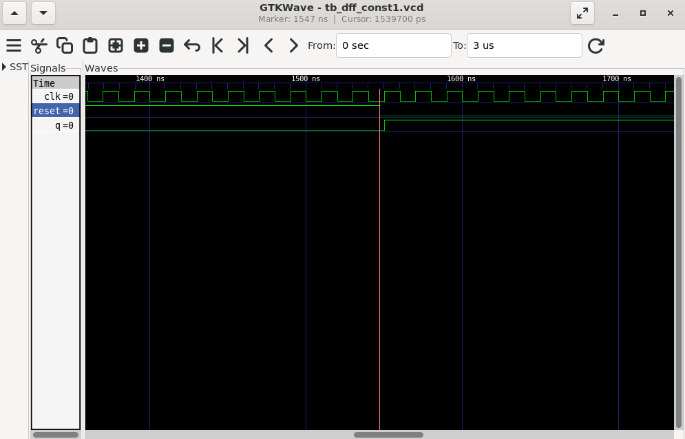<br/>
      dff_const1
    </td>
    <td align="center">
      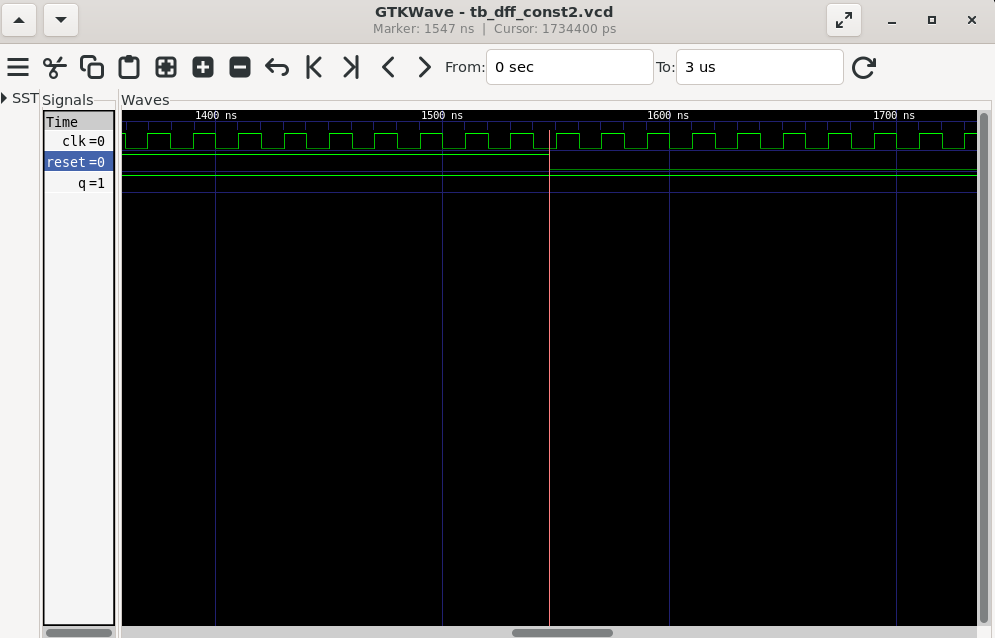<br/>
      dff_const2
    </td>
  </tr>
  <table align="center">
  <tr>
    <td align="center">
      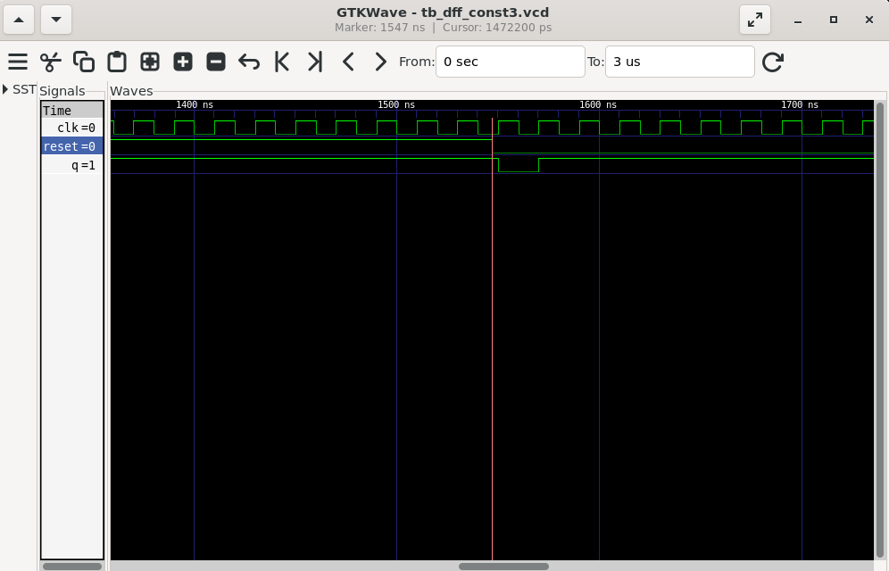<br/>
      dff_const3
    </td>
    <td align="center">
      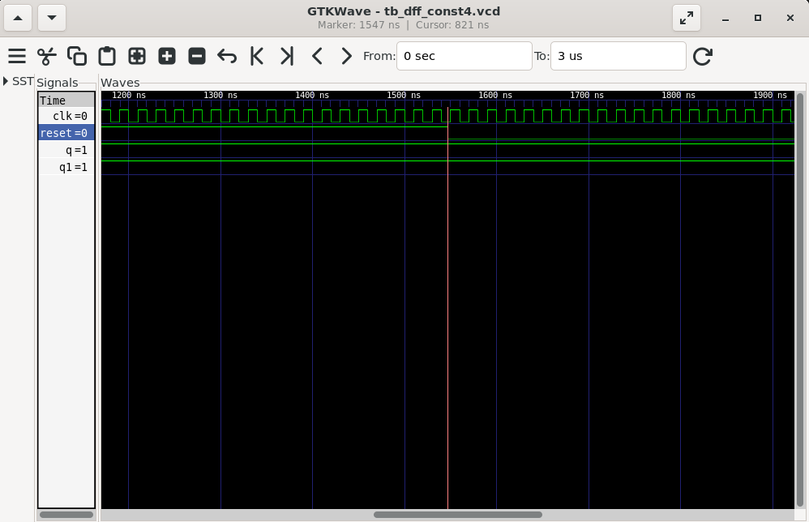<br/>
      dff_const4
    </td>
  </tr>
</table>
  
<p align="center">
  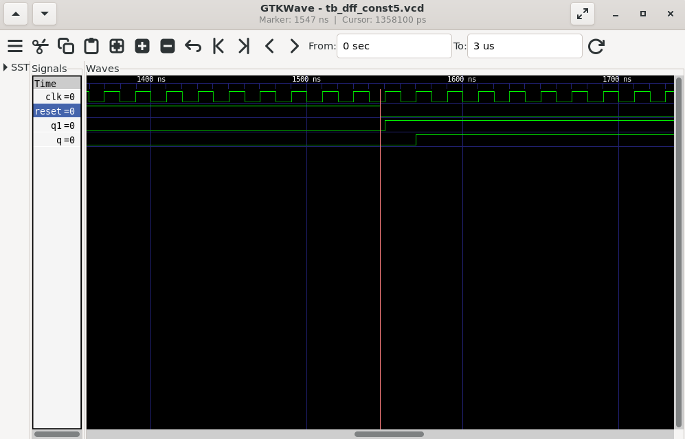
  dff_const5
</p>

**Yosys Synthesis**

```tcl
yosys
read_liberty -lib ../lib/sky130_fd_sc_hd__tt_025C_1v80.lib
read_verilog dff_const1.v
synth -top dff_const1
dfflibmap -liberty ../lib/sky130_fd_sc_hd__tt_025C_1v80.lib
abc -liberty ../lib/sky130_fd_sc_hd__tt_025C_1v80.lib
show
```

Screenshot:
<table align="center">
  <tr>
    <td align="center">
      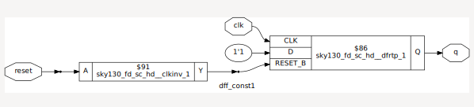<br/>
      dff_const1
    </td>
    <td align="center">
      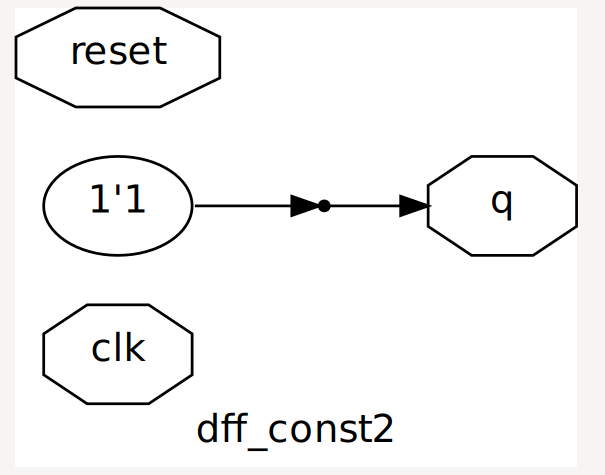<br/>
      dff_const2
    </td>
  </tr>
  <table align="center">
  <tr>
    <td align="center">
      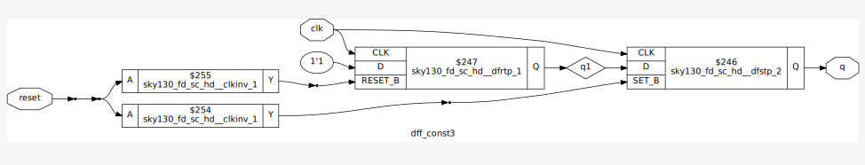<br/>
      dff_const3
    </td>
    <td align="center">
      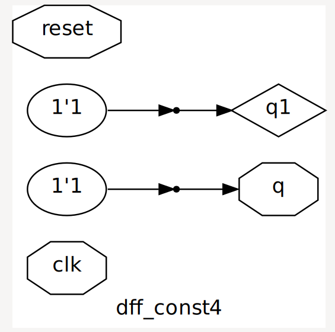<br/>
      dff_const4
    </td>
  </tr>
</table>
  
<p align="center">
  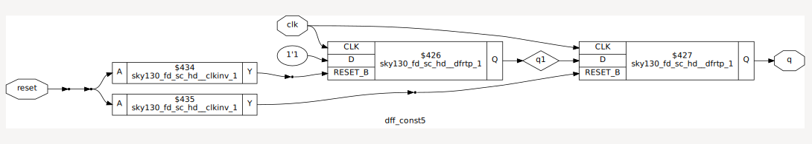
  dff_const5
</p>


### Unused Output Optimization

#### counter\_opt.v (initial)

* Normal counter design with unused outputs.
  ```verilog
  module counter_opt (input clk , input reset , output q);
  reg [2:0] count;
  assign q = count[0];
  
  always @(posedge clk ,posedge reset)
  begin
  	if(reset)
  		count <= 3'b000;
  	else
  		count <= count + 1;
  end
  endmodule
  ```

#### counter\_opt2.v (modified)

* Instead of assigning `q = count[0]`, use:

  ```verilog
  assign q = (count[2:0] == 3'b100);
  ```

**Yosys Commands**

```tcl
read_liberty -lib ../lib/sky130_fd_sc_hd__tt_025C_1v80.lib
read_verilog counter_opt2.v
synth -top counter_opt
dfflibmap -liberty ../lib/sky130_fd_sc_hd__tt_025C_1v80.lib
abc -liberty ../lib/sky130_fd_sc_hd__tt_025C_1v80.lib
show
```

Screenshot:
<table align="center">
  <tr>
    <td align="center">
      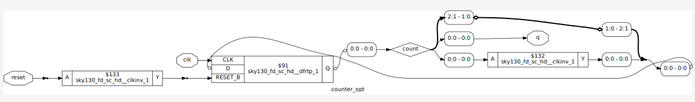<br/>
      counter_opt
    </td>
    <td align="center">
      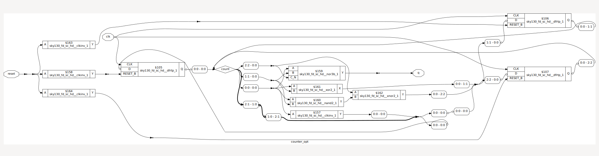<br/>
      counter_opt2
    </td>
  </tr>
</table>
<p align="center">
  
</p>

---
