# Day 4 - GLS, blocking vs non-blocking and Synthesis-Simulation mismatch

Welcome to **Day 4 of the RTL Design Workshop!**  
Today we focus on three major concepts:

- **Gate-Level Simulation (GLS)**
- **Synthesis-Simulation Mismatch**
- **Blocking vs. Non-Blocking Assignments in Verilog**

We will explore theory, common pitfalls, and run labs with simulations and synthesis.

---

## Table of Contents
1. [Gate-Level Simulation (GLS)](#1-gate-level-simulation-gls)  
2. [Synthesis-Simulation Mismatch](#2-synthesis-simulation-mismatch)  
3. [Blocking vs. Non-Blocking Assignments](#3-blocking-vs-non-blocking-assignments)  
4. [Labs](#4-labs)  
   - [Lab 1: Ternary Operator MUX](#lab-1-ternary-operator-mux)  
   - [Lab 2: Bad MUX (Mismatch Example)](#lab-2-bad-mux-mismatch-example)  
   - [Lab 3: Good MUX (Fixed Version)](#lab-3-good-mux-fixed-version)  
   - [Lab 4: Blocking Caveat](#lab-4-blocking-caveat)  
5. [Summary](#5-summary)  

---

## 1. Gate-Level Simulation (GLS)

**What is GLS?**  
- Simulation of the **synthesized netlist** (instead of RTL).  
- Ensures functional correctness is preserved after synthesis.  
- Helps validate logic and timing behavior (delays not yet annotated here).  

**Why GLS?**  
- **Verification**: Ensures RTL and synthesized design behave the same.  
- **Check tool mismatches**: Detect issues caused by incomplete sensitivity lists, bad coding styles, etc.  

---

## 2. Synthesis-Simulation Mismatch

When RTL simulation and synthesized netlist simulation differ.  

**Causes:**  
- Missing sensitivity list → `always @(sel)` should be `always @(*)`.  
- Blocking (`=`) vs Non-blocking (`<=`) assignments misused.  
- Non-standard or ambiguous Verilog coding.  

---

## 3. Blocking vs. Non-Blocking Assignments

- **Blocking (`=`):** Sequential, executes immediately.  
- **Non-Blocking (`<=`):** Concurrent, executes at end of time step.  

### Example Caveat
```verilog
always @(*) begin
  d = x & c;   // uses old x
  x = a | b;   // updated after
end
````

Here, `d` sees the *old* value of `x`, not the new one.
Correct order should be:

```verilog
always @(*) begin
  x = a | b;
  d = x & c;
end
```

---

## 4. Labs

### Lab 1: Ternary Operator MUX

**Verilog (ternary\_operator\_mux.v):**

```verilog
module ternary_operator_mux (input i0, input i1, input sel, output y);
  assign y = sel ? i1 : i0;
endmodule
```

#### RTL Simulation (GTKWave)

<p align="center">
  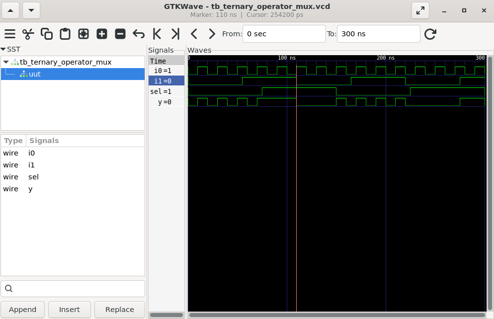
</p>

#### Synthesized Netlist (Yosys)

<p align="center">
  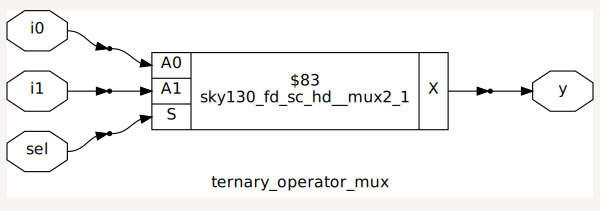
</p>

#### GLS Simulation (GTKWave)

<p align="center">
  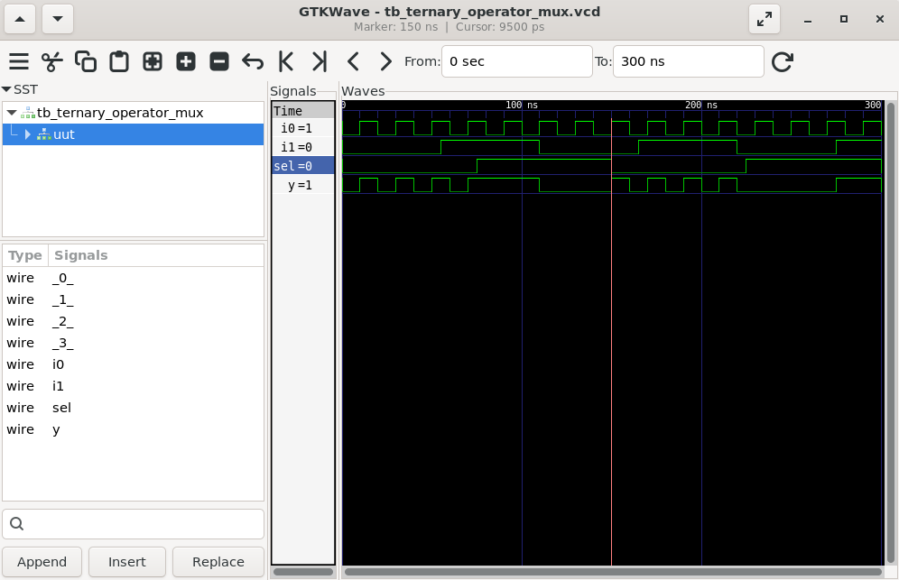
</p>

---

### Lab 2: Bad MUX (Mismatch Example)

**Verilog (bad\_mux.v):**

```verilog
module bad_mux (input i0, input i1, input sel, output reg y);
  always @ (sel) begin
    if (sel)
      y <= i1;
    else 
      y <= i0;
  end
endmodule
```

**Issues:**

1. Incomplete sensitivity list (`i0` and `i1` missing).
2. Non-blocking assignment (`<=`) used in combinational logic.

#### RTL Simulation (GTKWave)

<p align="center">
  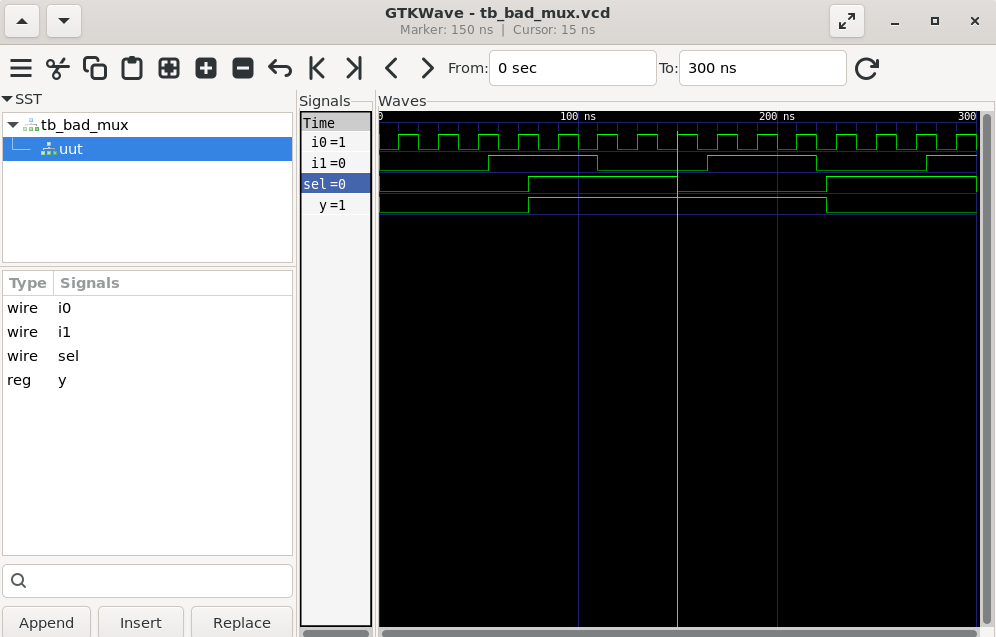
</p>

#### Synthesized Netlist (Yosys)

<p align="center">
  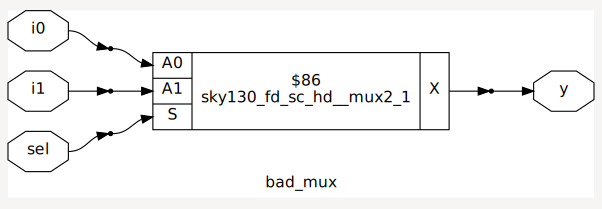
</p>

#### GLS Simulation (GTKWave)

<p align="center">
  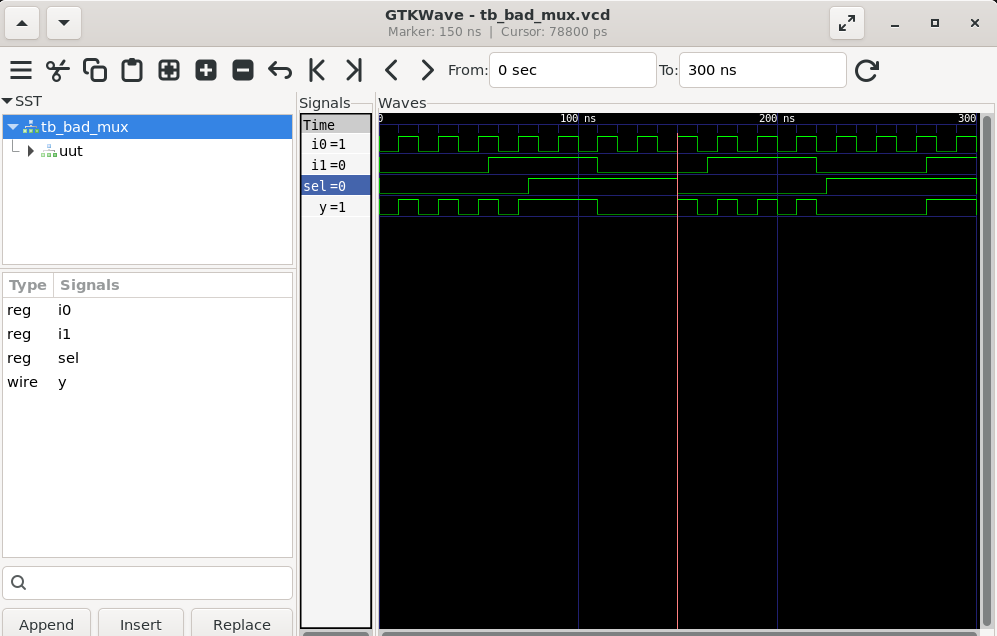
</p>

---

### Lab 3: Good MUX (Fixed Version)

**Verilog (good\_mux.v):**

```verilog
module good_mux (input i0, input i1, input sel, output reg y);
  always @ (*) begin
    if (sel)
      y = i1;
    else 
      y = i0;
  end
endmodule
```

**Fixes:**

* Correct sensitivity list.
* Blocking assignment (`=`) used in combinational logic.

#### RTL Simulation (GTKWave)

<p align="center">
  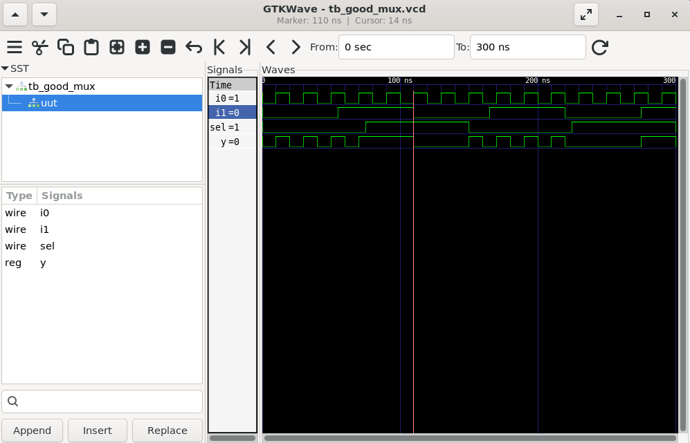
</p>

#### Synthesized Netlist (Yosys)

<p align="center">
  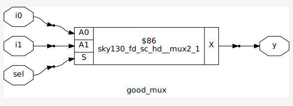
</p>

#### GLS Simulation (GTKWave)

<p align="center">
  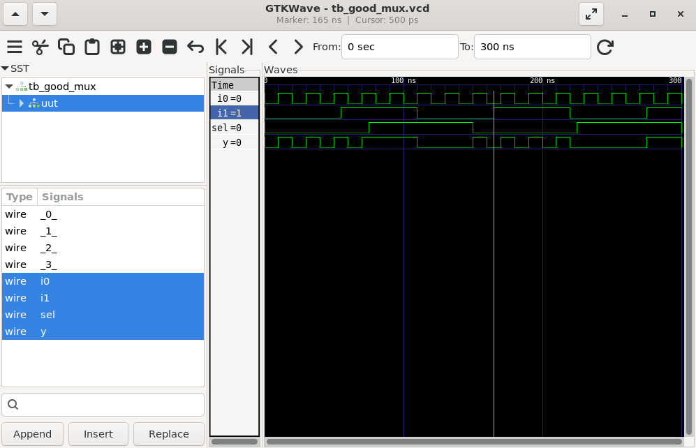
</p>

---

### Lab 4: Blocking Caveat

**Verilog (blocking\_caveat.v):**

```verilog
module blocking_caveat (input a, input b, input c, output reg d);
  reg x;
  always @ (*) begin
    d = x & c;
    x = a | b;
  end
endmodule
```

**Issue:**

* Due to blocking assignment order, `d` sees old value of `x`.

**Corrected Version:**

```verilog
always @ (*) begin
  x = a | b;
  d = x & c;
end
```

#### RTL Simulation (GTKWave)

<p align="center">
  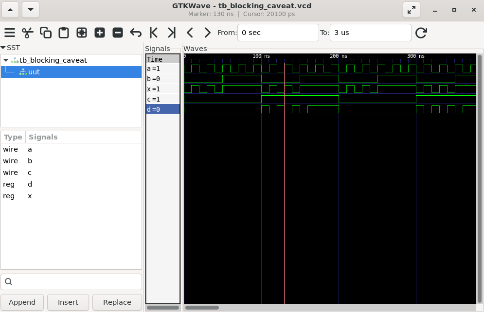
</p>

#### Synthesized Netlist (Yosys)

<p align="center">
  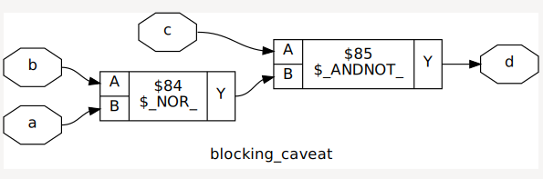
</p>

#### GLS Simulation (GTKWave)

<p align="center">
  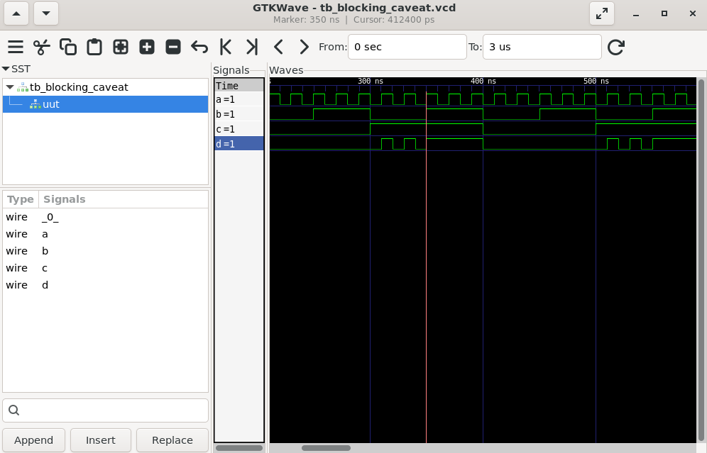
</p>

---

## 5. Summary

* **GLS** validates design after synthesis.
* **Mismatch** can occur due to missing sensitivity lists, misuse of blocking/non-blocking, or poor coding style.
* **Blocking (`=`)** → Combinational logic.
* **Non-Blocking (`<=`)** → Sequential logic.
* Labs demonstrated common pitfalls and fixes with **MUX** and **blocking caveat** examples.

```
