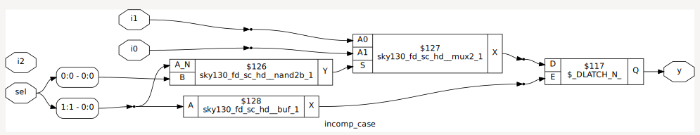

# Day 5 – Optimization in synthesis: If/Else, Case Statements, and Looping Constructs

---

## Table of Contents
1. [Introduction](#introduction)
2. [If-Else Statements](#if-else-statements)  
   - [Incomplete If](#example-incomplete-if)  
   - [Incomplete If-Else If](#example-incomplete-if-else-if)
3. [Case Statements](#case-statements)  
   - [Incomplete Case](#example-incomplete-case)  
   - [Complete Case with Default](#example-complete-case-with-default)  
   - [Partial Assignments](#example-partial-assignments)  
   - [Bad Case (Overlapping)](#example-bad-case-overlapping)
4. [Looping Constructs](#looping-constructs)  
   - [For Loop – MUX](#example-mux-with-for-loop)  
   - [For Loop – DEMUX](#example-demux-with-for-loop)  
   - [Generate For Loop – Ripple Carry Adder](#example-ripple-carry-adder-rca)
5. [Full Adder Module](#full-adder-fa)
6. [Summary](#summary)

---

## Introduction
This session covers **decision-making constructs** in Verilog (`if/else`, `case`) and **looping constructs** (`for`, `generate for`).  

- **If/Else** introduces **priority logic**. Missing conditions may infer **latches**.  
- **Case** avoids priority but requires **default** and complete assignments. Overlapping cases can cause ambiguity.  
- **Loops** are used to generate repeated hardware efficiently.  
  - **For loops** (inside `always`) → useful for MUX/DEMUX.  
  - **Generate for loops** → used for structural replication, e.g. adders.  

We will simulate (GTKWave), synthesize (Yosys), and in special cases, check **Gate-Level Simulation (GLS)**.

---

## If-Else Statements

### Example: Incomplete If
```verilog
module incomp_if (input i0 , input i1 , input i2 , output reg y);
always @ (*)
begin
    if(i0)
        y <= i1;
end
endmodule
````

📷 Simulation (GTKWave)

<p align="center">
  
</p>

📷 Yosys Synthesis

<p align="center">
  
</p>

---

### Example: Incomplete If-Else If

```verilog
module incomp_if2 (input i0 , input i1 , input i2 , input i3, output reg y);
always @ (*)
begin
    if(i0)
        y <= i1;
    else if (i2)
        y <= i3;
end
endmodule
```

📷 Simulation (GTKWave)

<p align="center">
  
</p>

📷 Yosys Synthesis

<p align="center">
  
</p>

---

## Case Statements

* **No priority** unlike if-else.
* Must handle all cases or add `default` to avoid latches.
* Avoid overlapping cases (undefined behavior).

### Example: Incomplete Case

```verilog
module incomp_case (input i0 , input i1 , input i2 , input [1:0] sel, output reg y);
always @ (*)
begin
    case(sel)
        2'b00 : y = i0;
        2'b01 : y = i1;
    endcase
end
endmodule
```

📷 Simulation (GTKWave)

<p align="center">
  
</p>

📷 Yosys Synthesis

<p align="center">
  
</p>

---

### Example: Complete Case with Default

```verilog
module comp_case (input i0 , input i1 , input i2 , input [1:0] sel, output reg y);
always @ (*)
begin
    case(sel)
        2'b00 : y = i0;
        2'b01 : y = i1;
        default : y = i2;
    endcase
end
endmodule
```

📷 Simulation (GTKWave)

<p align="center">
  
</p>

📷 Yosys Synthesis

<p align="center">
  
</p>

---

### Example: Partial Assignments

```verilog
module partial_case_assign (input i0 , input i1 , input i2 , input [1:0] sel, output reg y , output reg x);
always @ (*)
begin
    case(sel)
        2'b00 : begin
            y = i0;
            x = i2;
        end
        2'b01 : y = i1;
        default : begin
            x = i1;
            y = i2;
        end
    endcase
end
endmodule
```

📷 Simulation (GTKWave)

<p align="center">
  
</p>

📷 Yosys Synthesis

<p align="center">
  
</p>

---

### Example: Bad Case (Overlapping)

```verilog
module bad_case (input i0 , input i1, input i2, input i3 , input [1:0] sel, output reg y);
always @(*)
begin
    case(sel)
        2'b00: y = i0;
        2'b01: y = i1;
        2'b10: y = i2;
        2'b1?: y = i3; // Overlap with 2’b10 and 2’b11
    endcase
end
endmodule
```

📷 GLS (Gate-Level Simulation)

<p align="center">
  
</p>

---

## Looping Constructs

### Example: MUX with For Loop

```verilog
module mux_generate (input i0 , input i1, input i2 , input i3 , input [1:0] sel, output reg y);
wire [3:0] i_int;
assign i_int = {i3,i2,i1,i0};
integer k;
always @ (*)
begin
    for(k = 0; k < 4; k=k+1) begin
        if(k == sel)
            y = i_int[k];
    end
end
endmodule
```

📷 Simulation (GTKWave)

<p align="center">
  
</p>

📷 Yosys Synthesis

<p align="center">
  
</p>

---

### Example: DEMUX with For Loop

```verilog
module demux_generate (output o0 , output o1, output o2 , output o3, output o4, output o5, output o6 , output o7 , input [2:0] sel  , input i);
reg [7:0]y_int;
assign {o7,o6,o5,o4,o3,o2,o1,o0} = y_int;
integer k;
always @ (*)
begin
    y_int = 8'b0;
    for(k = 0; k < 8; k++) begin
        if(k == sel)
            y_int[k] = i;
    end
end
endmodule
```

📷 Simulation (GTKWave)

<p align="center">
  
</p>

📷 Yosys Synthesis

<p align="center">
  
</p>

---

### Example: Ripple Carry Adder (RCA)

```verilog
module rca (input [7:0] num1 , input [7:0] num2 , output [8:0] sum);
wire [7:0] int_sum;
wire [7:0] int_co;

genvar i;
generate
    for (i = 1 ; i < 8; i=i+1) begin
        fa u_fa_1 (.a(num1[i]),.b(num2[i]),.c(int_co[i-1]),.co(int_co[i]),.sum(int_sum[i]));
    end
endgenerate

fa u_fa_0 (.a(num1[0]),.b(num2[0]),.c(1'b0),.co(int_co[0]),.sum(int_sum[0]));

assign sum[7:0] = int_sum;
assign sum[8] = int_co[7];
endmodule
```

📷 Simulation (GTKWave)

<p align="center">
  
</p>

📷 Yosys Synthesis

<p align="center">
  
</p>

---

## Full Adder (FA)

```verilog
module fa (input a , input b , input c, output co , output sum);
    assign {co,sum}  = a + b + c ;
endmodule
```

---

## Summary

* **If/Else** → Priority logic, risk of latches.
* **Case** → No priority, must add `default`, avoid overlaps.
* **Loops** → Save code and generate repetitive hardware.

  * `for` inside always → behavioral MUX/DEMUX.
  * `generate for` → structural replication (adders).
* **GLS** helps catch ambiguous coding (e.g., overlapping case).
