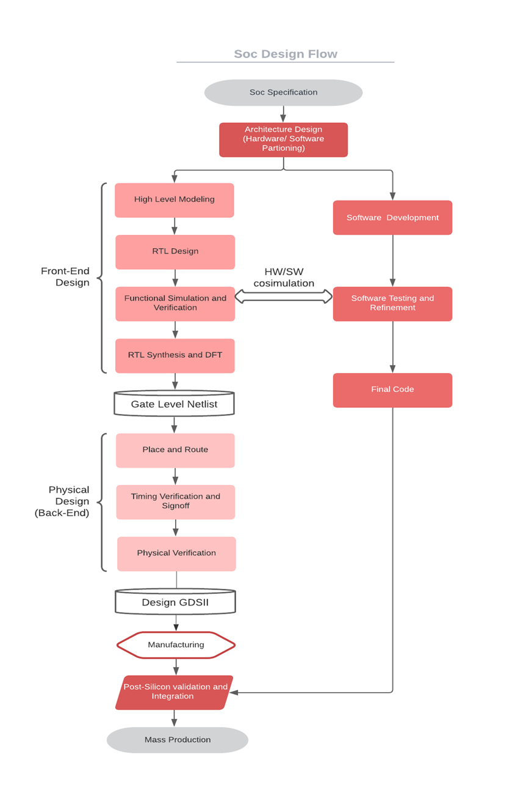
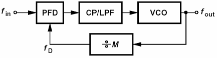

# **Part 1 – BabySoC Fundamentals & Functional Modelling **

## **Objective**

The goal of this task is to understand the **fundamentals of SoC design**, explore **functional modelling** concepts, and simulate BabySoC—a compact System-on-Chip (SoC) integrating a **RISC-V CPU**, **PLL**, and **10-bit DAC**. This simulation provides a hands-on understanding of digital-analog interfacing and clock synchronization in SoCs.

---

## **1. What is a System-on-Chip (SoC)?**

A **System-on-Chip (SoC)** is a single-chip solution that integrates most or all components of a computing system:

* **CPU:** Executes instructions and controls data flow.
* **Memory:** RAM for temporary storage, ROM/Flash for permanent storage.
* **I/O Ports:** Interfaces to communicate with external devices (sensors, DACs, ADCs).
* **Interconnect/Buses:** Enables communication between components.
* **Specialized IPs:** Hardware accelerators, DSPs, PLLs, or cryptography blocks.

**Advantages of SoCs:**

| Advantage         | Description                                     |
| ----------------- | ----------------------------------------------- |
| Compact Size      | Reduces the footprint of electronic devices.    |
| Energy Efficiency | Reduced data travel and fewer chips save power. |
| High Performance  | Faster communication between components.        |
| Cost Efficiency   | Lower manufacturing cost than discrete systems. |
| Reliability       | Fewer components reduce failure points.         |

**Applications:** Smartphones, tablets, wearables, IoT devices, TVs, cars, and appliances.

---

## **2. Types of SoCs**

1. **Microcontroller-based SoC**

   * Optimized for simple control tasks.
   * Low-power consumption.
   * Example: Arduino, STM32-based devices.

2. **Microprocessor-based SoC**

   * Can run complex operating systems.
   * Higher processing capability.
   * Example: Snapdragon, Apple A-series.

3. **Application-Specific SoC (ASIC)**

   * Optimized for specific tasks.
   * High-performance and efficiency for specialized applications.
   * Example: Graphics accelerators, AI chips.

**SoC Design Flow**:

---

## **3. Introduction to BabySoC**

**VSDBabySoC** is an educational SoC designed to:

* Teach SoC fundamentals.
* Provide functional modelling practice.
* Demonstrate digital-analog conversion.

**Main Components:**

| Component               | Description                                                       |
| ----------------------- | ----------------------------------------------------------------- |
| **RVMYTH (RISC-V CPU)** | Simple processor that generates digital data for DAC.             |
| **PLL**                 | Generates a stable, synchronized clock for CPU and DAC.           |
| **DAC**                 | Converts digital output into analog signals for external devices. |

### **3.1 Functional Flow**

**Step 1 – Reset & Initialization:**

* BabySoC starts with a `reset` signal.
* Activates PLL and CPU for synchronized operation.

**Step 2 – Clock Generation:**

* PLL generates a stable clock (`CLK`) for synchronous operation of RVMYTH and DAC.

**Step 3 – Data Processing:**

* RVMYTH CPU sequentially updates a register (`r17`) to produce digital signals (`RV_TO_DAC[9:0]`).

**Step 4 – Analog Conversion:**

* DAC receives the digital signal and converts it into a continuous analog output (`OUT`).
* This analog signal can drive TVs, audio devices, or other analog systems.

**Block Diagram of BabySoC:**

---

## **4. Phase-Locked Loop (PLL) in BabySoC**

A **PLL** is a feedback system that locks the output clock phase to a reference input.

**Components:**

* **Phase Detector (PD):** Compares reference vs. output clock.
* **Loop Filter (LF):** Filters the error signal.
* **Voltage-Controlled Oscillator (VCO):** Generates clock frequency based on error correction.

**Purpose in BabySoC:**

* Generates a stable system clock.
* Ensures CPU and DAC operate in harmony.
* Mitigates clock jitter and frequency deviations.

**Block Diagram of PLL:**

---

## **5. Digital-to-Analog Converter (DAC)**

A **Digital-to-Analog Converter (DAC)** is an electronic device that converts a binary digital signal into a corresponding analog voltage or current. In embedded systems, DACs are crucial for interfacing digital processors with the real analog world, such as speakers, motors, sensors, or displays.

---

### **5.1 DAC Function in BabySoC**

**Primary Function:**
The DAC in BabySoC receives the 10-bit digital output from the RVMYTH core (`RV_TO_DAC[9:0]`) and converts it into a proportional analog voltage. This allows BabySoC to interface with analog devices like TVs or audio equipment.

**Inputs and Outputs:**

* **Input:** `RV_TO_DAC[9:0]` – 10-bit digital data from the RISC-V core.
* **Output:** `OUT` – Analog voltage output.
* **Reference Voltages:**

  * `VREFL` – Lower reference voltage (e.g., 0V).
  * `VREFH` – Upper reference voltage (e.g., 3.3V).

---

### **5.2 DAC Equation**

The output analog voltage `OUT` is calculated using the standard formula for an N-bit DAC:

[
OUT = VREFL + \frac{D}{2^N - 1} \cdot (VREFH - VREFL)
]

Where:

* `D` = Digital input (0 to 2^N - 1)
* `N` = Number of bits (10 for BabySoC)
* `VREFL` = Lower reference voltage
* `VREFH` = Upper reference voltage

**Example Calculation:**

* If `D = 512`, `VREFL = 0V`, `VREFH = 3.3V`:

[
OUT = 0 + \frac{512}{1023} \cdot 3.3 \approx 1.65V
]

This shows that the DAC converts the digital midpoint to roughly half of the reference voltage.

---

### **5.3 Types of DACs**

There are several DAC architectures, each with pros and cons:

1. **Binary-Weighted Resistor DAC**

   * Uses resistors weighted by powers of 2.
   * Simple but requires precise resistor values.
   * Suitable for low-resolution DACs.

 

2. **R-2R Ladder DAC**

   * Uses a repeating network of resistors in a ladder configuration.
   * More practical for higher resolutions like 10-bit and above.
   * Easy to scale and less sensitive to resistor mismatch.

---

### **5.4 DAC in BabySoC**

BabySoC uses a **10-bit DAC** (likely implemented as an R-2R ladder internally) with:

* Input: `RV_TO_DAC[9:0]`
* Output: `OUT`
* Resolution: 10-bit
* Voltage range: `VREFL` to `VREFH`

This allows the digital processor to create a continuous analog waveform by varying the digital value over time.

---

### **5.5 Practical Usage**

* **Sound Generation:** Feeding a sequence of digital values representing a sine wave to the DAC produces an audible tone.
* **Video Signals:** For simple analog display, pixel intensity can be converted to analog voltages.
* **Testing:** In BabySoC, varying `RV_TO_DAC` allows students to observe waveform outputs in simulations (e.g., via `GTKWave`).

---

## **6. Role of Functional Modelling**

Functional simulation ensures the SoC **behaves correctly** before synthesis:

* Simulate data flow and timing between modules.
* Verify analog output matches digital inputs.
* Use **Icarus Verilog** and **GTKWave** to check waveforms.
* Identify design issues early (e.g., constant digital output, incorrect DAC conversion).

**Benefits:**

* Prevents hardware design errors.
* Provides visualization of signal interactions.
* Helps in understanding digital-analog interfacing.

---

## **7. Key Takeaways**

* BabySoC is an **educational SoC** to learn integration of CPU, PLL, and DAC.
* It demonstrates **digital signal processing** and **analog conversion**.
* Functional modelling is essential to verify system behavior before moving to RTL synthesis or layout.
* This simplified SoC provides a stepping stone from theoretical SoC design to practical hardware implementation.
