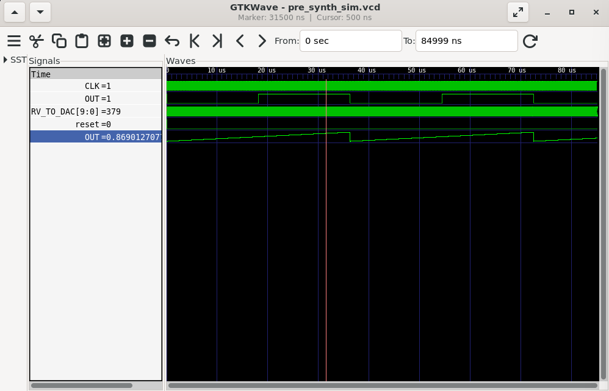

## **Task 2 – BabySoC Simulation**

### **Objective**

* Simulate the BabySoC design (VSDBabySoC) using Icarus Verilog.
* Generate waveforms to visualize the digital signals.
* Understand the interaction between RVMYTH (CPU), PLL, and DAC.

---

### **Step 1: Directory & Files Setup**

Here’s a concise explanation you can add in **Part 2** of your report for the repository you uploaded:

---

## **Repository for BabySoC Project – Part 2**

**Repository Link:** [https://github.com/RSavant490/vsd_RISC-V_Program_babySoC](https://github.com/RSavant490/vsd_RISC-V_Program_babySoC.git)

**Purpose:**
This repository hosts the complete BabySoC project designed for educational and functional simulation purposes. It includes all Verilog source files, testbenches, header files, and output directories necessary to simulate, synthesize, and observe the analog output behavior of the VSDBabySoC system.


**Key Features in Repository:**

1. **VSDBabySoC Top Module:** Integrates the RVMYTH CPU, PLL, and DAC for generating analog outputs.
2. **RVMYTH Module:** Implements a RISC-V core for generating sequential digital values for the DAC.
3. **PLL Module:** Generates a stable clock signal to synchronize all SoC components.
4. **DAC Module:** Converts the 10-bit digital signal from RVMYTH into an analog voltage.
5. **Testbench:** Prepares and verifies simulation, producing `.vcd` waveform files for visualization in GTKWave.

**Usage:**

* Clone the repository locally using:

```bash
git clone https://github.com/RSavant490/vsd_RISC-V_Program_babySoC.git
```

* In repo follows the same structure:
```
VSDBabySoC/
├── src/
│   ├── include/
│   │   └── header files (.vh)
│   └── module/
│       ├── vsdbabysoc.v
│       ├── rvmyth.v
│       ├── avsdpll.v
│       ├── avsddac.v
│       └── testbench.v
└── output/
```

* `testbench.v` is the top-level simulation file.
* `output/` will hold compiled binaries and waveform `.vcd` files.

---

### **Step 2: Compile with Icarus Verilog**

From the root directory (`VSDBabySoC`):

```bash
iverilog -o output/pre_synth_sim/pre_synth_sim.out -DPRE_SYNTH_SIM -DPRE_SYNTH_SIM \
    -I src/include -I src/module     src/module/testbench.v 
```

**Explanation:**

* `-o output/pre_synth_sim.out`: Compiled executable path.
* `-DPRE_SYNTH_SIM`: Preprocessor flag for simulation.
* `-I src/include -I src/module`: Include directories for Verilog headers & modules.
* Last arguments: all Verilog source files needed for simulation.

---

### **Step 3: Run the Simulation**

After compilation, run:

```bash
cd output/pre_synth_sim
./output/pre_synth_sim.out
```
---

### **Step 4: View Waveforms in GTKWave**

Open the waveform:

```bash
gtkwave output/pre_synth_sim.vcd
```
<p align="center">
   
</p>
* GTKWave GUI opens, showing all signals.
* Typical signals to analyze:

  * `CLK`: Clock from PLL
  * `RV_TO_DAC[9:0]`: Digital values from RVMYTH
  * `OUT`: Analog signal from DAC (if using real-valued simulation)

**Tip:** You can select, zoom, and add signals in GTKWave to study transitions.
---
